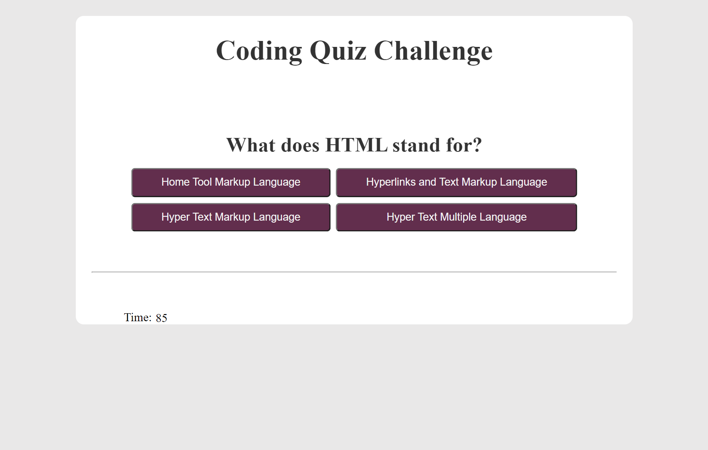
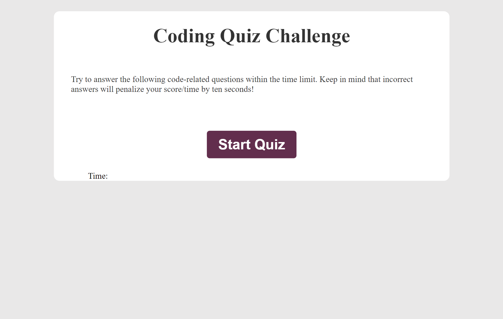

# Code Quiz

Welcome to the README file for the Code Quiz!

## Description
This code quiz is designed to test your knowledge of programming concepts and syntax in a specific programming language. In this quiz, you will be presented with a series of multiple-choice questions. You will have a limited amount of time to answer each question, and your score will be calculated based on the time remaining.

## Table of Contents 
1. To start the quiz, open the index.html file in your web browser.
2. Select Start button to start the quiz.
3. Read each question carefully and select the answer you think is correct, every incorrect answer will deduct 10 seconds from your time.
4. Once you have completed the quiz, your score will be displayed on the final page.
5. You can save your score by entering your initials in the input field and clicking the Save button.
6. You can delete your score by clicking the clear button.

## Files:
index.html: This is the main HTML file for the quiz.
style.css: This file contains the styles for the quiz.
script.js: This file contains the JavaScript code that runs the quiz.

Good luck and have fun!

- License: MIT

## Screenshot and link for the deployed application

[Link deployed application]((https://elisamarchete.github.io/code-quiz/))